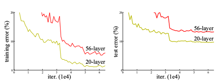
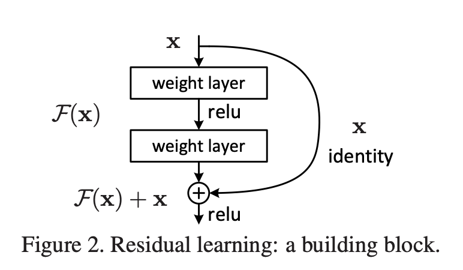
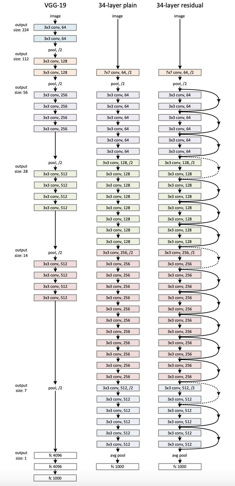
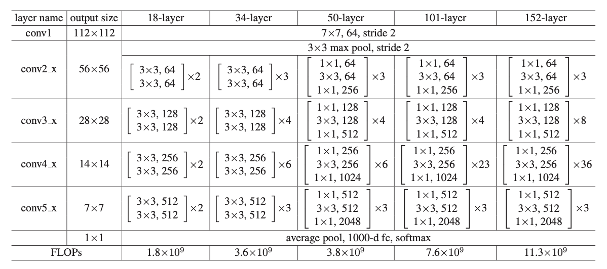
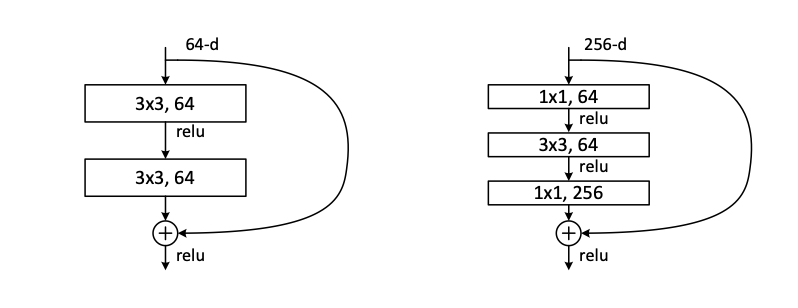
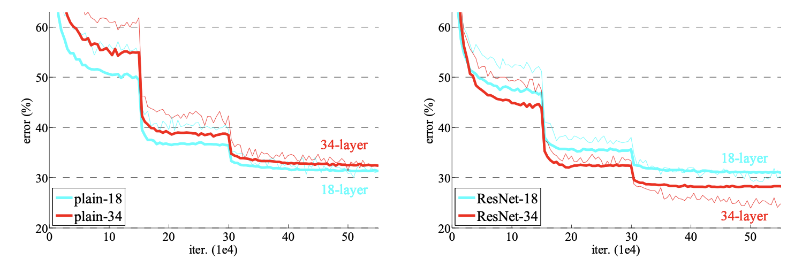
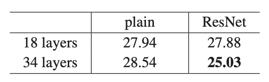
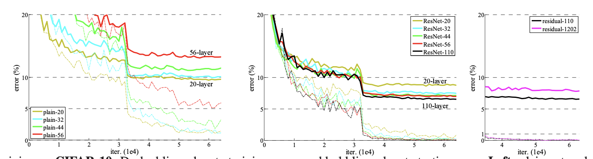
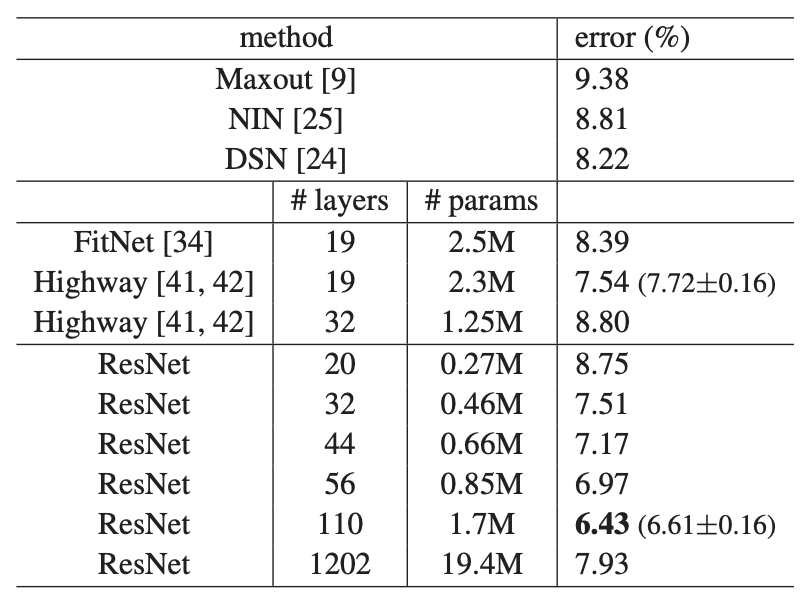
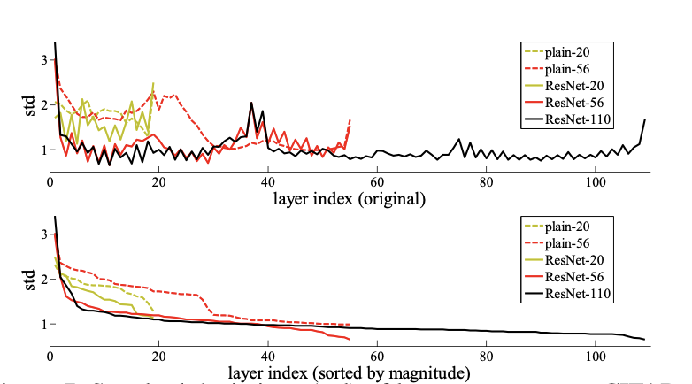

# Deep Residual Learning for Image Recognition (ResNet)

## What problem does the paper really solve?

Before ResNet, “just make it deeper” worked up to a point (AlexNet → VGG → GoogLeNet). But the authors highlight a counterintuitive failure mode they call the **degradation problem**:

- As you add layers to a sufficiently deep “plain” CNN (just stacked conv/BN/ReLU), **training error gets worse**, not better.
    
- This is **not** classic overfitting (where training error goes down but test error goes up). Here training error itself rises.
    

They show this cleanly on CIFAR-10: a **56-layer plain network** has _higher_ training and test error than a **20-layer plain network**. ([CVF Open Access](https://openaccess.thecvf.com/content_cvpr_2016/papers/He_Deep_Residual_Learning_CVPR_2016_paper.pdf "Deep Residual Learning for Image Recognition"))

### Figure 1 (CIFAR-10 degradation)

**Fig. 1** plots training and test error vs iterations for **plain 20 vs plain 56**. The deeper model is worse on both curves—this is the motivating pathology. ([CVF Open Access](https://openaccess.thecvf.com/content_cvpr_2016/papers/He_Deep_Residual_Learning_CVPR_2016_paper.pdf "Deep Residual Learning for Image Recognition"))

---

## The key idea: learn residuals, not full mappings

Let a few stacked layers be trying to learn some mapping $H(x)$ from input $x$.

Instead of learning $H(x)$ directly, ResNet makes the layers learn a **residual function**:

$$  
F(x) := H(x) - x \quad \Rightarrow \quad H(x)=F(x)+x  
$$

So the block outputs:

$$ 
y = F(x, {W_i}) + x  
$$

If the best thing a set of layers could do is “do nothing” (identity), then with residual learning it’s easy: push $F(x)\to 0$. The authors frame this as an optimization “preconditioning” effect: identity shortcuts make it easier for SGD to find good solutions. ([CVF Open Access](https://openaccess.thecvf.com/content_cvpr_2016/papers/He_Deep_Residual_Learning_CVPR_2016_paper.pdf "Deep Residual Learning for Image Recognition"))

### Figure 2 (Residual block)

**Fig. 2** is the canonical residual building block: two (or three) “weight layers” produce (F(x)), then an **identity shortcut** carries (x) around them, and the outputs are **added**. ([CVF Open Access](https://openaccess.thecvf.com/content_cvpr_2016/papers/He_Deep_Residual_Learning_CVPR_2016_paper.pdf "Deep Residual Learning for Image Recognition"))

---

## Shortcut connections and dimension changes (the practical engineering)

Identity addition requires the tensors to match shape. When spatial resolution or channel count changes, ResNet uses one of three shortcut strategies (paper’s “options”):

- **A: Identity + zero-padding** for channel increases (no extra params).
    
- **B: Projection shortcut only when dimensions increase** (a 1×1 conv on the skip path).
    
- **C: Projection shortcut for all blocks** (more params).
    

In ImageNet “fair” comparisons (same parameter count as plain), they often start with **A**; for deeper bottleneck nets they use **B**. ([CVF Open Access](https://openaccess.thecvf.com/content_cvpr_2016/papers/He_Deep_Residual_Learning_CVPR_2016_paper.pdf "Deep Residual Learning for Image Recognition"))

---

## What architectures did they actually test?

### Figure 3 (VGG vs Plain-34 vs ResNet-34)


**Fig. 3** contrasts:

- VGG-19 (very expensive FLOPs),
    
- a **34-layer plain** net,
    
- a **34-layer residual** net with shortcuts inserted.
    

The paper emphasizes that the plain-34 and res-34 have similar compute (~3.6B FLOPs), while VGG-19 is far heavier (~19.6B FLOPs). ([CVF Open Access](https://openaccess.thecvf.com/content_cvpr_2016/papers/He_Deep_Residual_Learning_CVPR_2016_paper.pdf "Deep Residual Learning for Image Recognition"))

### Table 1 (ImageNet family: 18/34 “basic”, 50/101/152 “bottleneck”)

**Table 1** defines the standard ResNet variants (18, 34, 50, 101, 152), including where downsampling happens and the block repeat counts. ([CVF Open Access](https://openaccess.thecvf.com/content_cvpr_2016/papers/He_Deep_Residual_Learning_CVPR_2016_paper.pdf "Deep Residual Learning for Image Recognition"))

### Figure 5 (Basic block vs Bottleneck block)

**Fig. 5** shows two block types:

- **Basic block** (ResNet-18/34): two 3×3 conv layers.
    
- **Bottleneck** (ResNet-50/101/152): 1×1 (reduce) → 3×3 → 1×1 (expand).
    
    - This keeps compute manageable while depth grows a lot.
        

TorchVision notes a small but important historical variant: many modern implementations (often called “ResNet v1.5”) move the stride within the bottleneck; the original paper’s placement differs. ([PyTorch Documentation](https://docs.pytorch.org/vision/main/models/resnet.html?utm_source=chatgpt.com "ResNet — Torchvision main documentation"))

---

## The central experiment: residual learning fixes degradation

### Figure 4 (ImageNet optimization curves)

**Fig. 4** compares 18 vs 34 layers:

- **Plain nets (left panel):** 34 layers trains worse than 18 (degradation).
    
- **ResNets (right panel):** 34 layers trains _better_ than 18, with lower training error and better validation. ([CVF Open Access](https://openaccess.thecvf.com/content_cvpr_2016/papers/He_Deep_Residual_Learning_CVPR_2016_paper.pdf "Deep Residual Learning for Image Recognition"))
    

### Table 2 (ImageNet top-1 error, 10-crop)

Table 2 quantifies the “same params” comparison:

- plain-18 vs plain-34: deeper is worse
    
- ResNet-18 vs ResNet-34: deeper is better (about **2.8%** top-1 gain in this setting) ([CVF Open Access](https://openaccess.thecvf.com/content_cvpr_2016/papers/He_Deep_Residual_Learning_CVPR_2016_paper.pdf "Deep Residual Learning for Image Recognition"))
    

That’s the paper’s headline claim: **residual connections primarily improve _optimization_** (training error), and the generalization follows.

---

## Scaling depth: ImageNet results up to 152 layers

The deeper bottleneck variants show monotonic gains (single model, 10-crop validation):

- ResNet-50 / 101 / 152 progressively reduce error (see Table 3/4 in the paper). ([CVF Open Access](https://openaccess.thecvf.com/content_cvpr_2016/papers/He_Deep_Residual_Learning_CVPR_2016_paper.pdf "Deep Residual Learning for Image Recognition"))
    

They also report that their **ILSVRC 2015** submission ensemble achieves **3.57% top-5 test error** (Table 5). ([CVF Open Access](https://openaccess.thecvf.com/content_cvpr_2016/papers/He_Deep_Residual_Learning_CVPR_2016_paper.pdf "Deep Residual Learning for Image Recognition"))

**Interpretation:** depth keeps paying off when optimization is stabilized by residual learning.

---

## CIFAR-10: going beyond 100 and even 1000 layers

In §4.2 they use a very simple CIFAR recipe (3×3 conv stacks with widths 16/32/64, global average pool, etc.), and show ResNets train smoothly to 110 layers and even 1202 layers. ([CVF Open Access](https://openaccess.thecvf.com/content_cvpr_2016/papers/He_Deep_Residual_Learning_CVPR_2016_paper.pdf "Deep Residual Learning for Image Recognition"))

### Figure 6 (CIFAR training curves)

**Fig. 6** shows:

- plain networks: deeper ones fail badly (plain-110 is so bad it’s off-plot)
    
- ResNets: deeper is fine; even 1202 layers optimizes (but doesn’t generalize best) ([CVF Open Access](https://openaccess.thecvf.com/content_cvpr_2016/papers/He_Deep_Residual_Learning_CVPR_2016_paper.pdf "Deep Residual Learning for Image Recognition"))
    

### Table 6 (CIFAR test error)

They report (with augmentation) that ResNet-110 achieves **~6.43%** test error (and give mean±std over runs). The 1202-layer model gets worse test error (~7.93%) despite tiny training error, hinting at diminishing returns / optimization–generalization tradeoffs at extreme depth. ([CVF Open Access](https://openaccess.thecvf.com/content_cvpr_2016/papers/He_Deep_Residual_Learning_CVPR_2016_paper.pdf "Deep Residual Learning for Image Recognition"))

### Figure 7 (Residual responses are small)

**Fig. 7** measures the standard deviation of layer responses (after BN, before nonlinearity) and shows ResNets’ residual branch outputs tend to be **smaller magnitude** than plain nets—supporting the intuition that blocks learn “small corrections” around identity. ([CVF Open Access](https://openaccess.thecvf.com/content_cvpr_2016/papers/He_Deep_Residual_Learning_CVPR_2016_paper.pdf "Deep Residual Learning for Image Recognition"))

---

## 8) Beyond classification: detection/localization improvements (COCO/VOC)

The CVPR paper’s main text focuses on classification; detection details are in the **supplement**.

In the supplemental, they plug **ResNet-101** into Faster R-CNN and show sizable gains:

- On COCO val, baseline Faster R-CNN with VGG-16 vs ResNet-101 improves both mAP@0.5 and the stricter COCO mAP@[.5:.95]. ([CVF Open Access](https://openaccess.thecvf.com/content_cvpr_2016/supplemental/He_Deep_Residual_Learning_2016_CVPR_supplemental.pdf "residual_v1_supp.pdf"))
    
- They explicitly call out a **~28% relative improvement** on COCO mAP@[.5:.95] from better features. ([CVF Open Access](https://openaccess.thecvf.com/content_cvpr_2016/supplemental/He_Deep_Residual_Learning_2016_CVPR_supplemental.pdf "residual_v1_supp.pdf"))
    

**Takeaway:** residual learning isn’t just a classification trick—its main product is **better, deeper features** that transfer strongly.

---

##  Why ResNets work (a modern, concrete intuition)

The paper’s core argument is optimization-centric:

1. **Identity is a good starting point.** Many layers _should_ behave like identity early in training (or in some regimes).
    
2. Residual parameterization makes “be identity” easy: set residual branch near zero.
    
3. Gradients have a more direct path through the identity shortcut, reducing the chance that optimization gets stuck in poor solutions that plague deep plain nets.
    

A nice way to think of it: a deep ResNet behaves like an ensemble of many shallow paths (because information can skip blocks), while still allowing deep compositions when needed.

---

## Codebase experiment you can run: Plain CNN vs ResNet on CIFAR-10

This is a small PyTorch script that trains:

- a **PlainNet** (no skip connections) built to mirror CIFAR ResNet-style stacking
    
- a **ResNet-CIFAR** (skip connections)
    

Run it at 20 vs 56 layers to observe degradation in the plain model and stable training in ResNet (exact numbers depend on compute/seed, but the qualitative effect often appears).

### `train_plain_vs_resnet_cifar.py`

```python
"""
Plain vs ResNet experiment on CIFAR-10 (in the spirit of He et al. 2015/2016).

Goal:
- Show the "degradation problem" in plain nets (deeper can train worse),
  and that residual connections fix optimization.

This is not an exact reproduction of the paper's hyper-params/implementation details,
but it's a faithful minimal experiment you can run on 1 GPU.

Dependencies:
  pip install torch torchvision

Usage examples:
  python train_plain_vs_resnet_cifar.py --model plain --depth 56
  python train_plain_vs_resnet_cifar.py --model resnet --depth 56
  python train_plain_vs_resnet_cifar.py --model plain --depth 20
"""

import argparse
import math
import os
import random
from dataclasses import dataclass

import torch
import torch.nn as nn
import torch.nn.functional as F
import torchvision
import torchvision.transforms as T


# -------------------------
# Reproducibility helpers
# -------------------------
def set_seed(seed: int = 42) -> None:
    random.seed(seed)
    torch.manual_seed(seed)
    torch.cuda.manual_seed_all(seed)


# -------------------------
# Building blocks (CIFAR-style)
# -------------------------
class BasicBlock(nn.Module):
    """CIFAR ResNet basic block: (3x3 -> BN -> ReLU) x2 + skip."""
    def __init__(self, in_ch: int, out_ch: int, stride: int = 1):
        super().__init__()
        self.conv1 = nn.Conv2d(in_ch, out_ch, 3, stride=stride, padding=1, bias=False)
        self.bn1 = nn.BatchNorm2d(out_ch)
        self.conv2 = nn.Conv2d(out_ch, out_ch, 3, stride=1, padding=1, bias=False)
        self.bn2 = nn.BatchNorm2d(out_ch)

        self.proj = None
        if stride != 1 or in_ch != out_ch:
            # Option B-style: projection when dimensions change
            self.proj = nn.Sequential(
                nn.Conv2d(in_ch, out_ch, kernel_size=1, stride=stride, bias=False),
                nn.BatchNorm2d(out_ch),
            )

    def forward(self, x):
        identity = x
        out = F.relu(self.bn1(self.conv1(x)), inplace=True)
        out = self.bn2(self.conv2(out))
        if self.proj is not None:
            identity = self.proj(identity)
        out = F.relu(out + identity, inplace=True)
        return out


class PlainBlock(nn.Module):
    """Same conv stack as BasicBlock but WITHOUT skip connection."""
    def __init__(self, in_ch: int, out_ch: int, stride: int = 1):
        super().__init__()
        self.conv1 = nn.Conv2d(in_ch, out_ch, 3, stride=stride, padding=1, bias=False)
        self.bn1 = nn.BatchNorm2d(out_ch)
        self.conv2 = nn.Conv2d(out_ch, out_ch, 3, stride=1, padding=1, bias=False)
        self.bn2 = nn.BatchNorm2d(out_ch)

    def forward(self, x):
        out = F.relu(self.bn1(self.conv1(x)), inplace=True)
        out = F.relu(self.bn2(self.conv2(out)), inplace=True)
        return out


# -------------------------
# Networks
# -------------------------
class CIFARStem(nn.Module):
    def __init__(self, out_ch: int = 16):
        super().__init__()
        self.conv = nn.Conv2d(3, out_ch, 3, stride=1, padding=1, bias=False)
        self.bn = nn.BatchNorm2d(out_ch)

    def forward(self, x):
        return F.relu(self.bn(self.conv(x)), inplace=True)


class ResNetCIFAR(nn.Module):
    """
    CIFAR ResNet of depth: 6n + 2 (paper's CIFAR design).
    Example: depth=20 => n=3 blocks per stage; 56 => n=9.
    """
    def __init__(self, depth: int, num_classes: int = 10):
        super().__init__()
        assert (depth - 2) % 6 == 0, "For CIFAR ResNet, depth should be 6n+2 (e.g., 20, 32, 44, 56, 110)."
        n = (depth - 2) // 6

        self.stem = CIFARStem(16)
        self.layer1 = self._make_stage(16, 16, n, stride=1)
        self.layer2 = self._make_stage(16, 32, n, stride=2)
        self.layer3 = self._make_stage(32, 64, n, stride=2)
        self.pool = nn.AdaptiveAvgPool2d((1, 1))
        self.fc = nn.Linear(64, num_classes)

        self._init_weights()

    def _make_stage(self, in_ch, out_ch, blocks, stride):
        layers = [BasicBlock(in_ch, out_ch, stride=stride)]
        for _ in range(1, blocks):
            layers.append(BasicBlock(out_ch, out_ch, stride=1))
        return nn.Sequential(*layers)

    def _init_weights(self):
        # Kaiming init is a common default; close in spirit to He initialization.
        for m in self.modules():
            if isinstance(m, nn.Conv2d):
                nn.init.kaiming_normal_(m.weight, nonlinearity="relu")

    def forward(self, x):
        x = self.stem(x)
        x = self.layer1(x)
        x = self.layer2(x)
        x = self.layer3(x)
        x = self.pool(x).flatten(1)
        return self.fc(x)


class PlainNetCIFAR(nn.Module):
    """Plain counterpart with the same depth schedule but no shortcuts."""
    def __init__(self, depth: int, num_classes: int = 10):
        super().__init__()
        assert (depth - 2) % 6 == 0, "For CIFAR plain net here, use the same 6n+2 depths."
        n = (depth - 2) // 6

        self.stem = CIFARStem(16)
        self.layer1 = self._make_stage(16, 16, n, stride=1)
        self.layer2 = self._make_stage(16, 32, n, stride=2)
        self.layer3 = self._make_stage(32, 64, n, stride=2)
        self.pool = nn.AdaptiveAvgPool2d((1, 1))
        self.fc = nn.Linear(64, num_classes)

        self._init_weights()

    def _make_stage(self, in_ch, out_ch, blocks, stride):
        layers = [PlainBlock(in_ch, out_ch, stride=stride)]
        for _ in range(1, blocks):
            layers.append(PlainBlock(out_ch, out_ch, stride=1))
        return nn.Sequential(*layers)

    def _init_weights(self):
        for m in self.modules():
            if isinstance(m, nn.Conv2d):
                nn.init.kaiming_normal_(m.weight, nonlinearity="relu")

    def forward(self, x):
        x = self.stem(x)
        x = self.layer1(x)
        x = self.layer2(x)
        x = self.layer3(x)
        x = self.pool(x).flatten(1)
        return self.fc(x)


# -------------------------
# Training loop
# -------------------------
@dataclass
class Metrics:
    loss: float
    acc: float


@torch.no_grad()
def evaluate(model, loader, device) -> Metrics:
    model.eval()
    total_loss, correct, n = 0.0, 0, 0
    for x, y in loader:
        x, y = x.to(device), y.to(device)
        logits = model(x)
        loss = F.cross_entropy(logits, y)
        total_loss += loss.item() * x.size(0)
        correct += (logits.argmax(1) == y).sum().item()
        n += x.size(0)
    return Metrics(loss=total_loss / n, acc=correct / n)


def train_one_epoch(model, loader, optim, device) -> Metrics:
    model.train()
    total_loss, correct, n = 0.0, 0, 0
    for x, y in loader:
        x, y = x.to(device), y.to(device)
        optim.zero_grad(set_to_none=True)
        logits = model(x)
        loss = F.cross_entropy(logits, y)
        loss.backward()
        optim.step()

        total_loss += loss.item() * x.size(0)
        correct += (logits.argmax(1) == y).sum().item()
        n += x.size(0)
    return Metrics(loss=total_loss / n, acc=correct / n)


def main():
    ap = argparse.ArgumentParser()
    ap.add_argument("--model", choices=["plain", "resnet"], default="resnet")
    ap.add_argument("--depth", type=int, default=56, help="Use 6n+2 depths: 20, 32, 44, 56, 110...")
    ap.add_argument("--epochs", type=int, default=200)
    ap.add_argument("--batch_size", type=int, default=128)
    ap.add_argument("--lr", type=float, default=0.1)
    ap.add_argument("--weight_decay", type=float, default=1e-4)
    ap.add_argument("--seed", type=int, default=42)
    ap.add_argument("--data_dir", type=str, default="./data")
    args = ap.parse_args()

    set_seed(args.seed)
    device = "cuda" if torch.cuda.is_available() else "cpu"

    # CIFAR-10 augmentation similar in spirit to the paper (pad+random crop+flip)
    train_tf = T.Compose([
        T.RandomCrop(32, padding=4),
        T.RandomHorizontalFlip(),
        T.ToTensor(),
        T.Normalize((0.4914, 0.4822, 0.4465), (0.2470, 0.2435, 0.2616)),
    ])
    test_tf = T.Compose([
        T.ToTensor(),
        T.Normalize((0.4914, 0.4822, 0.4465), (0.2470, 0.2435, 0.2616)),
    ])

    train_ds = torchvision.datasets.CIFAR10(root=args.data_dir, train=True, download=True, transform=train_tf)
    test_ds = torchvision.datasets.CIFAR10(root=args.data_dir, train=False, download=True, transform=test_tf)

    train_loader = torch.utils.data.DataLoader(train_ds, batch_size=args.batch_size, shuffle=True, num_workers=4, pin_memory=True)
    test_loader = torch.utils.data.DataLoader(test_ds, batch_size=256, shuffle=False, num_workers=4, pin_memory=True)

    if args.model == "resnet":
        model = ResNetCIFAR(depth=args.depth).to(device)
    else:
        model = PlainNetCIFAR(depth=args.depth).to(device)

    optim = torch.optim.SGD(model.parameters(), lr=args.lr, momentum=0.9, weight_decay=args.weight_decay, nesterov=False)

    # Simple step schedule (common for CIFAR ResNet)
    milestones = {int(args.epochs * 0.5), int(args.epochs * 0.75)}
    scheduler = torch.optim.lr_scheduler.MultiStepLR(optim, milestones=sorted(milestones), gamma=0.1)

    best_acc = 0.0
    for epoch in range(1, args.epochs + 1):
        tr = train_one_epoch(model, train_loader, optim, device)
        te = evaluate(model, test_loader, device)
        scheduler.step()

        best_acc = max(best_acc, te.acc)
        if epoch % 10 == 0 or epoch == 1:
            lr = optim.param_groups[0]["lr"]
            print(f"[{args.model.upper()} depth={args.depth}] epoch {epoch:03d} lr={lr:.4f} "
                  f"train: loss={tr.loss:.3f} acc={tr.acc*100:.2f}% | "
                  f"test: loss={te.loss:.3f} acc={te.acc*100:.2f}% | best={best_acc*100:.2f}%")

    print(f"Done. Best test accuracy: {best_acc*100:.2f}%")


if __name__ == "__main__":
    main()
```

### What to run (suggested quick comparisons)

On the same machine/seed:

- Plain, shallow vs deep:
    
    - `--model plain --depth 20`
        
    - `--model plain --depth 56`
        
- ResNet, shallow vs deep:
    
    - `--model resnet --depth 20`
        
    - `--model resnet --depth 56`
        
